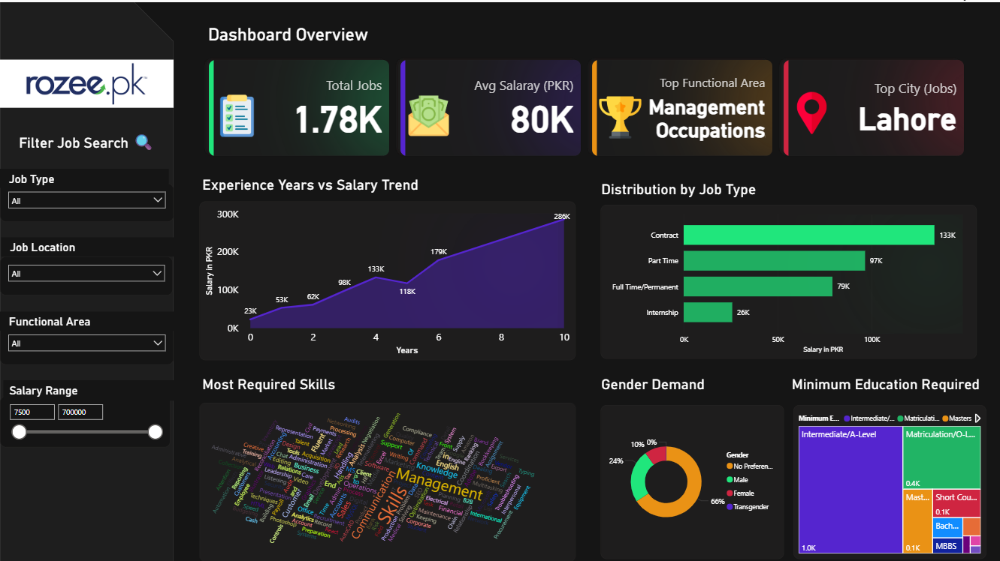

# 🚀 Job Market Insights from RozeePK – 2025 🔥

<p align="center">
  
</p>

<p align="center">
  &nbsp;
  <a href="Jobs-RozeePK.pbix" target="_blank">
    
  </a>
  &nbsp;
  <a href="https://www.kaggle.com/datasets/zincly/pakistan-job-market-dataset-rozee-pk" target="_blank">
    
  </a>
</p>

---

## 📌 Project Overview

This Power BI project analyzes **RozeePK Job Market – 2025**, using a **self-curated dataset** (published on [Kaggle](https://www.kaggle.com/datasets/zincly/pakistan-job-market-dataset-rozee-pk)) to uncover salary trends, hiring hotspots, skill demand, and city-level opportunities across Pakistan.

It transforms raw job postings into **actionable insights** for:

* 🎓 **Job seekers** → where to upskill & apply
* 🏢 **Employers** → benchmark salaries & demand
* 📊 **Researchers** → labor market patterns

---

## 📊 Interactive Insights

<details open>
<summary><b>📌 Key Highlights</b></summary>

* ✅ **1,780+ jobs** across industries
* ✅ **80,000 PKR** → average salary
* ✅ **Management** → top functional area
* ✅ **Lahore** → #1 city for job opportunities

</details>

<details>
<summary><b>💰 Salary Trends</b></summary>

* 📈 **Contract-based roles** → highest salaries
* 👔 **Experienced professionals & dept. heads** → up to **700K PKR**
* 📉 **Interns & fresh grads** → start around **19K PKR**
* ⚖️ **Full-time** sits between contract & internship salaries

</details>

<details>
<summary><b>🛠️ Most In-Demand Skills</b></summary>

* **Management & Leadership**
* **Communication & Coordination**
* **Software & IT** → JavaScript, MySQL, Networking
* **Marketing & Sales** → SEO, Branding, Digital Strategy
* **Finance & Accounting** → Bookkeeping, Payroll, Audits

</details>

<details>
<summary><b>🌍 Top Cities</b></summary>

* 🏙️ Lahore, Karachi, Islamabad → highest job volume
* 📌 Peshawar, Multan, Faisalabad → rising demand

</details>

---

## 💡 What This Means for Job Seekers

* 🔎 Focus on **high-demand skills** (management, IT, marketing)
* 🚀 Relocate or network in **major hubs** (Lahore, Karachi, Islamabad)
* 📈 Upskill for leadership roles to unlock higher salary brackets

---

## 🧱 Repo Structure

```
.
├── Jobs-RozeePK.pbix       # Power BI dashboard
├── preview.png             # Dashboard screenshot   
└── README.md
```

---

## 🔗 Resources

* 📂 **Dataset:** [Kaggle – RozeePK Job Market 2025]([https://www.kaggle.com/datasets/YOUR-KAGGLE/rozeepk-job-market-2025](https://www.kaggle.com/datasets/zincly/pakistan-job-market-dataset-rozee-pk))
* 🖥️ **PBIX File:** [Download here](Jobs-RozeePK.pbix)

---

## 📢 Connect

<p align="center">
  <a href="https://www.linkedin.com/in/syed-wajdan-zeerak" target="_blank">
    
  </a>
  &nbsp;
  <a href="https://www.kaggle.com/zincly" target="_blank">
    
  </a>
</p>

---

## 🏷️ Tags

`#PowerBI` `#DataAnalytics` `#JobMarket` `#PakistanJobs` `#HiringTrends` `#RozeePK` `#CareerGrowth`

---

⚡ *Work in Progress – More slices, visuals & interactive filters coming soon!*
